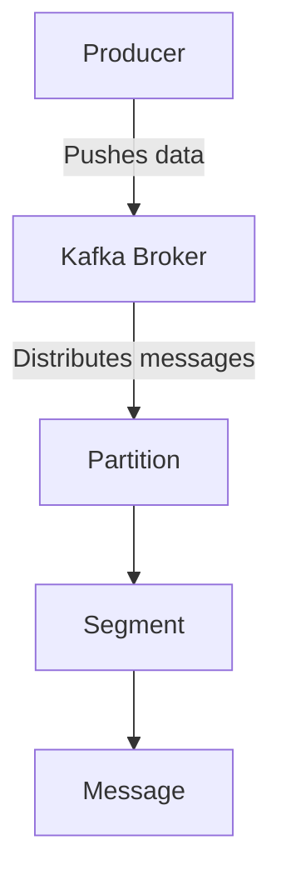
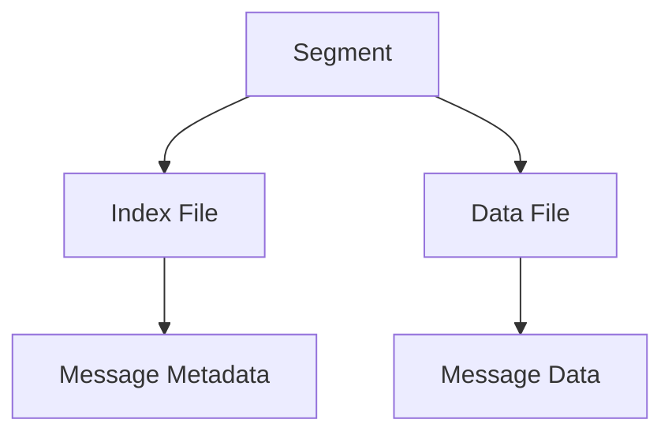
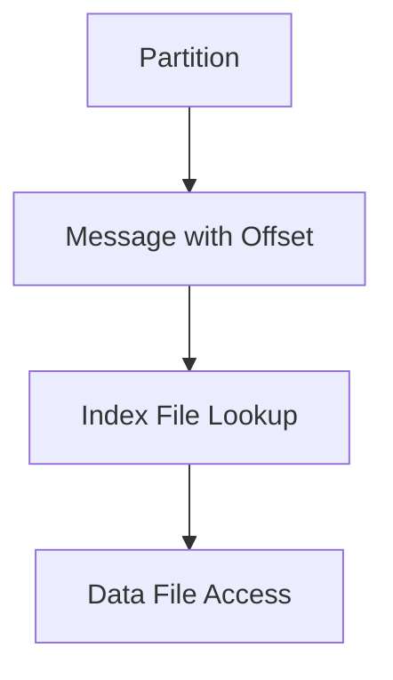
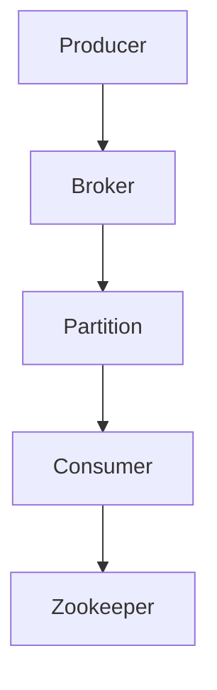
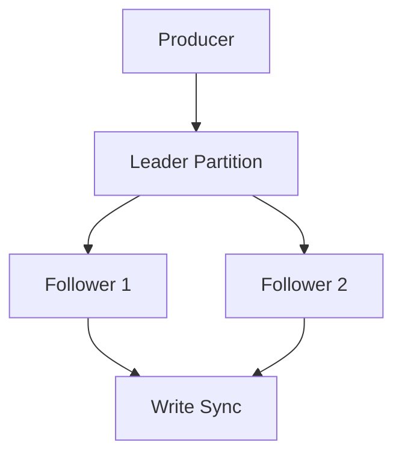
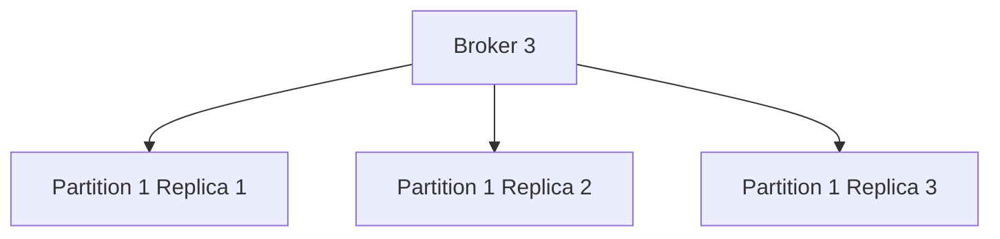
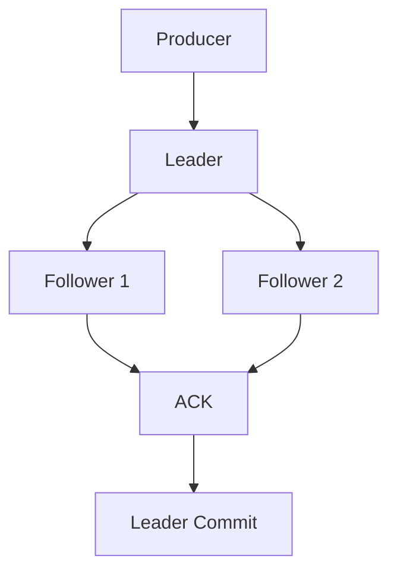
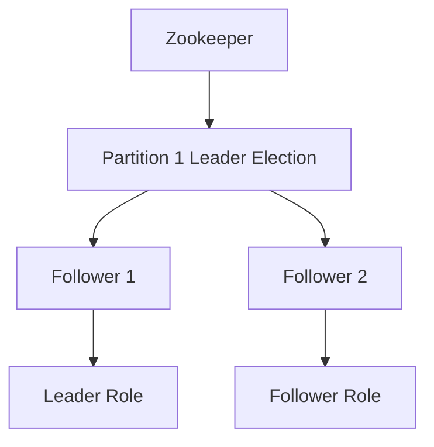

## Introduction

Apache Kafka, initially developed by LinkedIn, is a distributed messaging system that has become a core component of Apache's ecosystem. Written in Scala, Kafka is renowned for its scalability and high throughput. It is widely used in big data platforms and integrates seamlessly with distributed processing systems like Cloudera, Apache Storm, and Apache Spark.

As a commercially viable middleware, Kafka's message reliability is of utmost importance. How can we ensure the precise transmission, accurate storage, and correct consumption of messages? This article dives into Kafka's architecture and reliability mechanisms, including its storage structure, replication, and synchronization principles.

## Key Terminologies

| Term           | Explanation                                                                 |
|----------------|-----------------------------------------------------------------------------|
| Broker         | A Kafka node that handles message processing. Multiple brokers form a Kafka cluster. |
| Topic          | Kafka uses topics to categorize messages. Every message published to Kafka needs a topic. |
| Producer       | The client that sends messages to Kafka brokers.                            |
| Consumer       | The client that reads messages from Kafka brokers.                          |
| Consumer Group | A group of consumers, where each message can only be consumed by one consumer within the group. |
| Partition      | The physical division of a topic. A topic can have multiple partitions.     |
| Segment        | A partition is divided into multiple segments.                             |
| Offset         | A unique identifier for messages within a partition. Each message has a sequential offset number. |

## Kafka's Storage Mechanism

Kafka's storage mechanism can be understood from four aspects:

### Partition Distribution in Topics

In a Kafka cluster, each partition of a topic is stored across multiple brokers.  
For instance, consider a setup where a topic like report_push has four partitions.  
Kafka partitions are stored as directories with the naming convention: `topic-name-partition-index`.

### Partition File Storage

Each partition is stored as a series of segments, which are essentially large files.  
Each segment file consists of two parts: an index file (.index) and a data file (.log).

### Segment Storage Structure

A segment file includes index and data files. The index file stores metadata, while the data file stores actual messages.  
Segment files are named based on the last message's offset, helping Kafka efficiently locate data.

### Locating Messages Using Offsets

Kafka uses the offset to locate messages within the partition. Each message has an offset number, which is used to efficiently find and retrieve it.

## Kafka's Internal Architecture

The internal architecture of Kafka includes the following core components:

- **Producer:** Sends messages to the Kafka cluster.
- **Broker:** Handles messages and stores partitions.
- **Consumer:** Pulls messages from the Kafka cluster.
- **Zookeeper:** Manages Kafka's cluster state and coordinates leader election and partition management.

## Ensuring High Reliability

Kafka's high reliability stems from its robust replication mechanism, which ensures message availability even in the event of broker failures.

### Data Synchronization

Kafka introduced replication in version 0.8 to mitigate data loss during broker failures. Each partition has multiple replicas, with one replica acting as the leader and others as followers.

### Replica Placement Strategy

Kafka distributes replicas across multiple brokers to balance load. It employs a modular arithmetic approach to determine where to place replicas.

### Synchronization Strategy

Producers only send messages to the leader of a partition. After the leader writes the message, followers synchronize with the leader.

### Leader Election

Kafka's leader election is managed by Zookeeper, which uses a distributed lock mechanism to ensure that only one replica becomes the leader of a partition.

## Conclusion

Kafka's architecture ensures high reliability, scalability, and performance, making it a vital tool in modern data processing. With its sophisticated replication mechanism, partitioning strategies, and efficient storage system, Kafka delivers message guarantees and fault tolerance that are crucial in large-scale distributed systems.

The above content outlines Kafka's design and operational principles, integrating your provided article with added explanations and visualization using Mermaid diagrams. This should give a clear and comprehensive understanding of Kafka's message storage, architecture, and reliability features.
