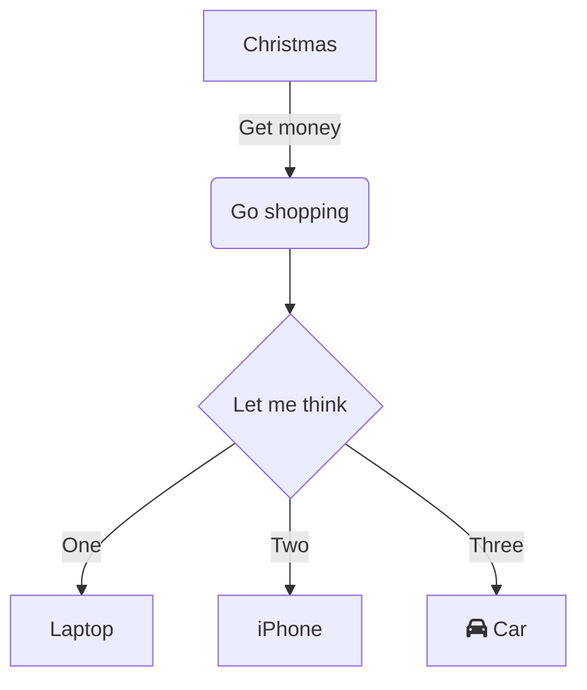

### Background
A significant part of system stability is supported by monitoring. Large companies usually have well-established monitoring and operations teams to build the monitoring infrastructure. From a layered perspective, monitoring generally includes the following aspects:
<table>
  <thead>
    <tr>
      <th>Monitoring Dimension</th>
      <th>Middleware Selection</th>
      <th>Reason for Selection</th>
    </tr>
  </thead>
  <tbody>
    <tr>
      <td>Metric Monitoring</td>
      <td>Prometheus + Grafana</td>
      <td>Supports multiple Exporters, rich ecosystem, easy to configure alerts and visualizations</td>
    </tr>
    <tr>
      <td>Log Monitoring</td>
      <td>Loki + Promtail/Fluent Bit</td>
      <td>Lightweight log aggregation solution, seamlessly integrates with Grafana</td>
    </tr>
    <tr>
      <td>Distributed Tracing</td>
      <td>OpenTelemetry + Jaeger</td>
      <td>Open standard for distributed tracing, supports multiple languages</td>
    </tr>
    <tr>
      <td>Database Monitoring</td>
      <td>Exporter (e.g., MySQL Exporter)</td>
      <td>Prometheus maintained by official or community, supports mainstream databases</td>
    </tr>
    <tr>
      <td>Network Monitoring</td>
      <td>Blackbox Exporter</td>
      <td>Supports multi-protocol health checks like HTTP, TCP</td>
    </tr>
    <tr>
      <td>Alerting and Notification</td>
      <td>Alertmanager</td>
      <td>Supports multi-channel notifications (email, Slack, Webhook, SMS, etc.)</td>
    </tr>
  </tbody>
</table>

### Best Practices for Selection
Small and medium-sized companies can quickly build a monitoring system that suits their business characteristics. Prometheus has already become the standard for real-time monitoring. We can quickly set up our own monitoring system based on Prometheus:
<table>
  <thead>
    <tr>
      <th>Monitoring Dimension</th>
      <th>Middleware Selection</th>
      <th>Reason for Selection</th>
    </tr>
  </thead>
  <tbody>
    <tr>
      <td>Metric Monitoring</td>
      <td>Prometheus + Grafana</td>
      <td>Supports multiple Exporters, rich ecosystem, easy to configure alerts and visualizations</td>
    </tr>
    <tr>
      <td>Log Monitoring</td>
      <td>Loki + Promtail/Fluent Bit</td>
      <td>Lightweight log aggregation solution, seamlessly integrates with Grafana</td>
    </tr>
    <tr>
      <td>Distributed Tracing</td>
      <td>OpenTelemetry + Jaeger</td>
      <td>Open standard for distributed tracing, supports multiple languages</td>
    </tr>
    <tr>
      <td>Database Monitoring</td>
      <td>Exporter (e.g., MySQL Exporter, Redis Exporter)</td>
      <td>Prometheus maintained by official or community, supports mainstream databases</td>
    </tr>
    <tr>
      <td>Network Monitoring</td>
      <td>Blackbox Exporter</td>
      <td>Supports multi-protocol health checks like HTTP, TCP</td>
    </tr>
    <tr>
      <td>Alerting and Notification</td>
      <td>Alertmanager</td>
      <td>Supports multi-channel notifications (email, Slack, Webhook, SMS, etc.)</td>
    </tr>
  </tbody>
</table>

### System Architecture Design

  graph TD;
    A[Prometheus] --> B[Exporters]
    A --> C[Blackbox Exporter]
    A --> D[Alertmanager]
    B --> E[Grafana]
    C --> E
    D --> E
    F[Loki] --> G[Promtail/Fluent Bit]
    G --> E
    H[OpenTelemetry] --> I[Jaeger]
    I --> E

### Defining Refined Monitoring Metrics
#### JVM Monitoring

JVM monitoring is used to track important JVM metrics, including GC (Garbage Collection) instant metrics, heap memory metrics, non-heap memory metrics, metaspace metrics, direct buffer metrics, JVM thread count, etc. This section introduces JVM monitoring and how to view JVM monitoring metrics.

JVM monitoring can track the following metrics:

- GC (Garbage Collection) instant and cumulative details
    - FullGC count
    - YoungGC count
    - FullGC duration
    - YoungGC duration
- Heap Memory Details
    - Total heap memory
    - Old generation heap memory size
    - Young generation Survivor area size
    - Young generation Eden area size
- Metaspace
    
    Metaspace size
    
- Non-Heap Memory
    - Maximum non-heap memory size
    - Used non-heap memory size
- Direct Buffer
    - Total DirectBuffer size (bytes)
    - Used DirectBuffer size (bytes)
- JVM Thread Count
    - Total number of threads
    - Number of deadlocked threads
    - Number of newly created threads
    - Number of blocked threads
    - Number of runnable threads
    - Number of terminated threads
    - Number of threads in timed wait
    - Number of threads in waiting state

mindmap
  root((Java进程占用内存))
    JVM内存
      堆内存
        年轻代
        老年代
      堆外内存
        元空间
        压缩类空间
        虚拟机线程栈
        本地线程栈
        代码缓冲区
        直接缓冲
    非JVM内存
      本地运行库
      JNI本地代码 

#### Host Monitoring

Host monitoring tracks various metrics such as CPU, memory, disk, load, network traffic, and network packet metrics. This section introduces host monitoring and how to view host monitoring metrics.

Host monitoring can track the following metrics:

- CPU
    - Total CPU usage
    - System CPU usage
    - User CPU usage
    - CPU usage waiting for I/O completion
- Physical Memory
    - Total system memory
    - Free system memory
    - Used system memory
    - Memory in PageCache
    - Memory in BufferCache
- Disk
    - Total system disk size
    - Free system disk size
    - Used system disk size
- Load
    
    System load average
    
- Network Traffic
    - Network received bytes
    - Network sent bytes
- Network Packets
    - Number of received packets per minute
    - Number of sent packets per minute
    - Number of network errors per minute
    - Number of dropped packets per minute
    
#### **SQL Call Analysis**

View SQL call analysis to understand SQL call patterns in applications.

#### Error Code Monitoring

For core business systems, such as payment systems, error code monitoring is essential.

Here’s how to install Prometheus step by step in English. If you use the docker you can use this to setup, this is the easy way. [springboot-promethenus-grafana](https://github.com/maddenmanel/springboot-prometheus-grafana). 

#### Install Article list

- [Install Loki with Prometheus](/tool/stability-monitor-loki/)
- [Install Promtail with Prometheus](/tool/stability-monitor-promtail/)
  
